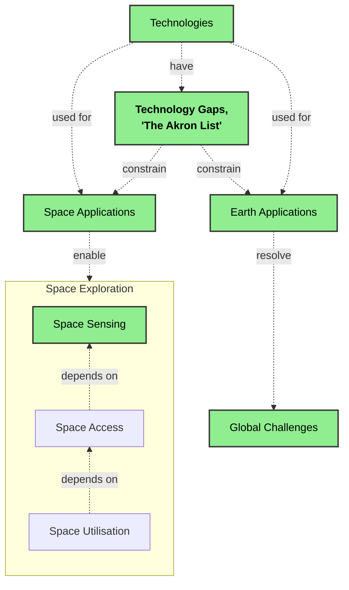

# Akron Project

## Vision

Space sensing forms the foundation of space exploration, enabling humanity’s future.

## Mission

To enable the continuous identification, monitoring, and resolution of critical technology gaps to full and efficient space sensing for humanity.

## Scope

The Akron Project focuses exclusively on civilian, scientific, commercial, environmental, and humanitarian applications of space sensing technologies.

Military, defence, intelligence, and weapon-related applications, both on Earth and in Space, are explicitly out of scope.

## Problem Statement

The problem is multifaceted and stems from three interconnected challenges:

1. Humanity lacks a clear understanding of how advances in space sensing directly contribute to solving today’s global challenges.
1. There is no unified, prioritised global framework that identifies and categorises the critical technology gaps required for full and efficient space sensing.
1. The current approach to addressing space sensing technology gaps is not optimised at a systems level.

## Impact

1. Policy-makers, educators, investors, and international institutions are hindered from making fully informed decisions.
1. Research and development efforts remain fragmented across disciplines, nations, and organisations, slowing progress and duplicating investment.
1. International cooperation is inconsistent, educational pathways are insufficiently aligned with future technological needs, and public and private investments are prioritised without a long-term, coordinated strategy.

## Proposed Solution

Develop and maintain a curated list of technology gaps, highlighting their impact on both space sensing and global challenges on Earth.

## Cognitive Map / Information Model

*Green boxes show the Akron Project's focus.*

## Maintainers

This project is maintained by [Valentin Grigoryevsky](https://www.linkedin.com/in/vgrigoryevsky/).

For questions, suggestions, or contributions regarding The [Akron List](akron-list/index.md), please contact the maintainer.

## License

This work is licensed under the [Creative Commons Attribution-NonCommercial-ShareAlike 4.0 International License](https://creativecommons.org/licenses/by-nc-sa/4.0/).

You are free to:

- Share — copy and redistribute the material in any medium or format
- Adapt — remix, transform, and build upon the material for educational, research, and development purposes

Under the following terms:

- Attribution — You must give appropriate credit to the Akron Project
- NonCommercial — You may not use the material for commercial purposes or direct monetisation
- ShareAlike — If you remix or build upon the material, you must distribute your contributions under the same license

This license enables educators, researchers, students, policy-makers, and engineers to freely use, study, and build upon this work while ensuring it remains accessible to all.
